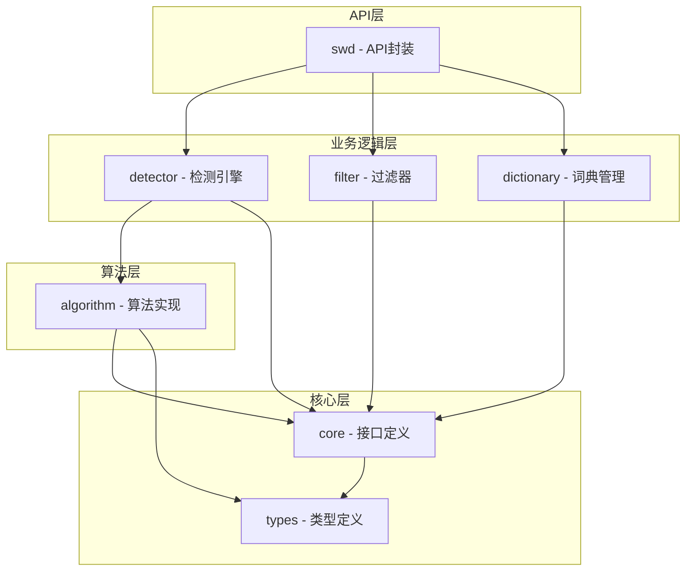

# Go-SWD (Sensitive Words Detection)


一个高性能的敏感词检测和过滤库，基于 Go 语言开发，采用整洁架构设计。专注于中文文本的敏感词检测，支持多种检测策略和灵活的扩展机制。

## 主要特性

- 🚀 超高性能：基于优化的 Trie 和 AC 自动机算法
- 📚 并发安全：支持高并发场景，内置多重并发优化机制
- 📚 海量词库：内置20W+敏感词，经过深度优化和去重后保留7W+高质量词条
- 🎯 精准检测：支持多种文本匹配策略
- 🔄 灵活分类：支持多种敏感词分类（涉黄、涉政、暴力等），可独立开关
- 🛠 可扩展：支持自定义词库扩展，支持动态更新
- 📦 轻量级：无外部依赖，即插即用
- 🔒 安全性：内置多种反规避机制
- 💡 智能匹配：支持模糊匹配、变体识别

## 反规避特性

V1.0 版本支持：
- 基础文本匹配
- 特殊字符过滤

后续版本规划：
- 大小写混淆检测（如：FuCk -> fuck）
- 全半角混淆检测（如：ｆｕｃｋ -> fuck）
- 数字样式检测（如：9⓿二肆⁹₈ -> 902498）
- 特殊字符插入检测（如：f*u*c*k -> fuck）
- 中文拼音混合检测
- 同音字检测
- 形近字检测

## 快速开始

### 安装

```bash
go get github.com/ttofTnT/go-swd
```

### 基础使用

```go
package main

import (
	"fmt"
	"log"

	"github.com/ttofTnT/go-swd"
)

func main() {
	// 1. 创建实例
	detector, err := swd.New()
	if err != nil {
		log.Fatal(err)
	}

	// 2. 添加自定义敏感词（可选）
	customWords := map[string]swd.Category{
		"涉黄":    swd.Pornography,    // 涉黄分类
		"涉政":    swd.Political,      // 涉政分类
		"赌博词汇":  swd.Gambling,       // 赌博分类
		"毒品词汇":  swd.Drugs,          // 毒品分类
		"脏话词汇":  swd.Profanity,      // 脏话分类
		"歧视词汇":  swd.Discrimination, // 歧视分类
		"诈骗词汇":  swd.Scam,           // 诈骗分类
		"自定义词汇": swd.Custom,         // 自定义分类
	}
	if err := detector.AddWords(customWords); err != nil {
		log.Fatal(err)
	}

	// 3. 基本检测
	text := "这是一段包含敏感词涉黄和涉政的文本"
	fmt.Println("是否包含敏感词:", detector.Detect(text))

	// 4. 检测指定分类
	fmt.Println("是否包含涉黄内容:", detector.DetectIn(text, swd.Pornography))
	fmt.Println("是否包含涉政内容:", detector.DetectIn(text, swd.Political))
	fmt.Println("是否包含赌博内容:", detector.DetectIn(text, swd.Gambling))
	fmt.Println("是否包含毒品内容:", detector.DetectIn(text, swd.Drugs))

	// 5. 检测多个分类
	fmt.Println("是否包含涉黄或涉政内容:", detector.DetectIn(text, swd.Pornography, swd.Political))
	fmt.Println("是否包含任意预定义分类:", detector.DetectIn(text, swd.All))

	// 6. 获取匹配结果
	if word := detector.Match(text); word != nil {
		fmt.Printf("首个敏感词: %s (分类: %s)\n", word.Word, word.Category)
	}

	// 7. 获取所有匹配
	words := detector.MatchAll(text)
	for _, word := range words {
		fmt.Printf("敏感词: %s (分类: %s, 位置: %d-%d)\n",
			word.Word, word.Category, word.StartPos, word.EndPos)
	}

	// 8. 敏感词过滤
	filtered := detector.ReplaceWithAsterisk(text) // 使用 * 替换
	fmt.Println("过滤后的文本:", filtered)

	// 9. 自定义替换策略
	customFiltered := detector.ReplaceWithStrategy(text, func(word swd.SensitiveWord) string {
		return fmt.Sprintf("[%s]", word.Category) // 替换为分类名
	})
	fmt.Println("自定义替换后的文本:", customFiltered)

	// 10. 移除敏感词
	if err := detector.RemoveWord("自定义敏感词1"); err != nil {
		log.Printf("移除敏感词失败: %v", err)
	}

	// 11. 清空词库
	if err := detector.Clear(); err != nil {
		log.Printf("清空词库失败: %v", err)
	}
}
```

## 项目架构

本项目采用清晰的分层架构设计，遵循Clean Architecture的原则，各层次职责分明，依赖关系清晰。

### 核心模块

- **检测引擎** (Detector)
  - 实现敏感词检测算法
  - 支持多种匹配策略
  
- **过滤器** (Filter)
  - 处理文本过滤和替换
  - 提供多样化的过滤策略
  
- **词典管理** (Dictionary)
  - 管理敏感词词库
  - 支持动态更新和扩展
  
- **算法实现** (Algorithm)
  - 封装核心算法实现
  - 包括Trie树和AC自动机等

### 并发设计

- **并发安全的词库管理**
  - 使用 `sync.Map` 实现线程安全的词典存储
  - 原子操作保证计数器和时间戳的一致性
  
- **高效的批量处理**
  - 批量加载支持，减少锁竞争
  - 智能的通知机制，避免频繁更新
  
- **上下文控制**
  - 支持 `context` 取消和超时控制
  - 优雅的并发任务管理
  
- **性能优化**
  - 通知节流机制，避免过度通知
  - 批量操作优化，提高并发效率
  - 无锁设计，减少竞争开销

### 项目架构图



## 项目结构

```
pkg/
├── core/           # 核心接口定义
├── types/          # 基础类型定义
├── algorithm/      # 算法实现（Trie树、AC自动机等）
├── detector/       # 敏感词检测引擎
├── filter/         # 敏感词过滤策略
├── dictionary/     # 词库管理
│   ├── default/    # 内置词库
│   └── loader.go   # 词库加载器
└── swd/           # API封装，提供统一的对外接口

```

## 许可证

本项目采用 Apache 许可证。详情请见 [LICENSE](LICENSE) 文件。
